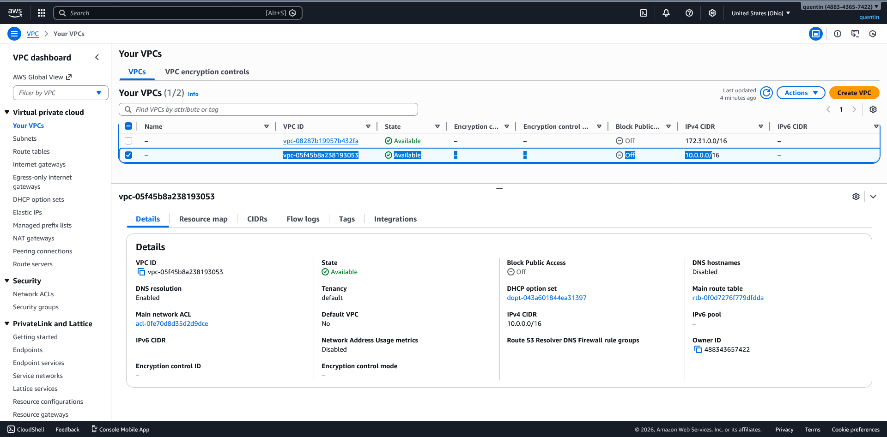
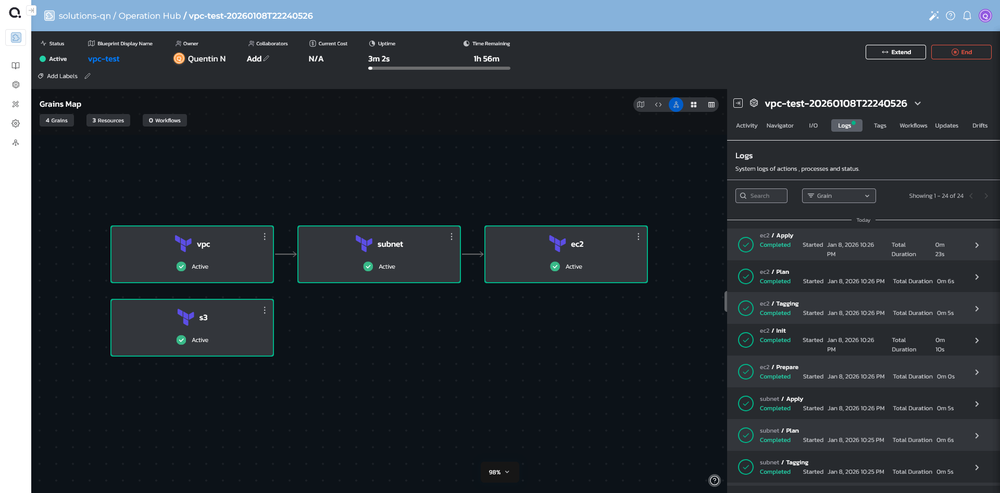
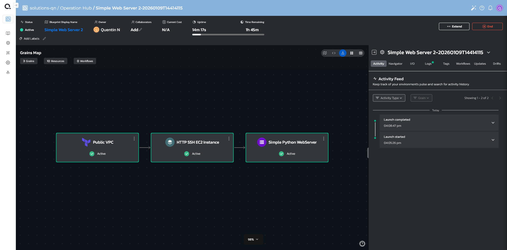
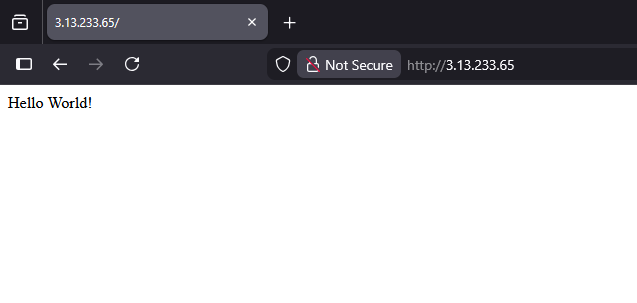

# Quali's Home Assignment - Deploying a Simple Environment Using Torque Platform

### Overview

My work towards this assignment is split into two branches.

* `master`
	* This branch contains the first blueprint I created with the intentions of
		seeing and learning what the Torque platform has to offer. After creating
		this I realized that I need to simplify my approach, which is represented
		in
		`attempt2`.
* `attempt2`
	* This branch contains the production solution to my assignment using the
		lessons learned from the `master` to guide my methodology.

### Master

My initial phase was to attempt to get my bearings and familiarize myself with
the software stack I would be using. In doing so I put together an EC2, S3
bucket, VPC, and subnets as a rough draft. I took the knowledge of the Torque
platform I learned here and applied it towards what would become branch
`attempt2`


*First Terraform grain launching in the Torque platform. This then created the
VPC below in AWS*


*Verification of the resource living in AWS*


*From here I built upon the VPC to create a subnet which was used as a
dependency to the EC2 instance. The EC2 instance was given an associated public
IP address with a security group allowing SSH and HTTP ports inbound. I used
the Torque blueprint designer to tie the necessary input and outputs together*

* *vpc.id -> subnet*
* *vpc.id -> ec2*
* *subnet.id -> ec2*

### Attempt2

Having a better understanding of the Torque platform, of how each individual
grain should be scoped and their inputs and outputs, I revised my approach.

Solution blueprint plan:

```
* VPC with a public subnet.
* Ubuntu EC2 with HTTP and SSH ports ingress allowed.
* Ansible:
	* Create an http directory.
	* Create and start a systemd unit to run a python webserver.
```

I started by creating two Terraform modules for the VPC and EC2 grains. After
getting each of these to successfully launch through Torque, I then created an
Ansible playbook to set up the EC2 instance. A major challenge I encountered
here was getting a private key file written for Ansible to SSH into the EC2
instance. The documentation on Ansible grain
[scripts](https://docs.qtorque.io/blueprint-designer-guide/blueprints/ansible-grain?_highlight=vault#scripts)
was very helpful in guiding me to the solution I ended up using. 
I added a sensitive input that is passed to the `Simple Python Webserver` 
Ansible grain. This is then passed as a parameter to a script that writes a 
valid RSA key file which the grain can use to connect to its dependent 
EC2's `public_ip`.


*Completed blueprint launch*

<br>
*Deployed python webserver being accessed*
