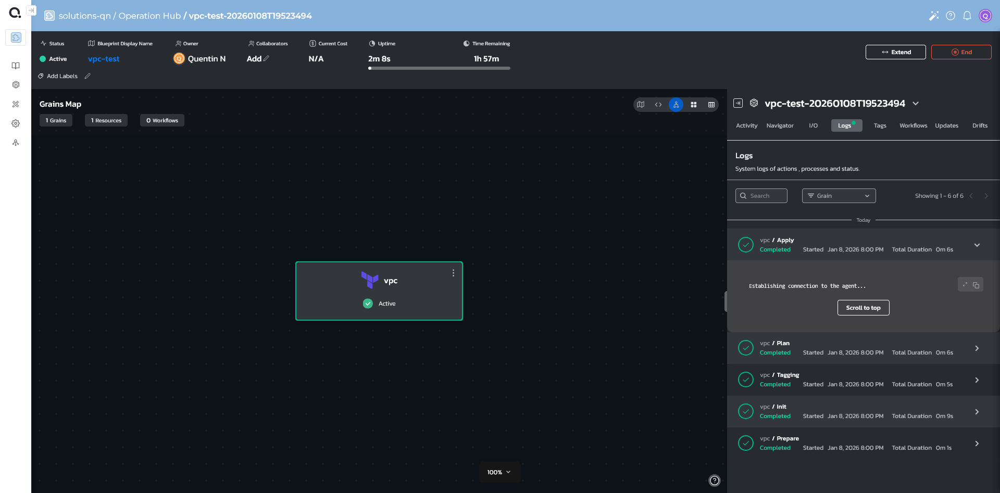

# Quali's Home Assignment - Deploying a Simple Environment Using Torque Platform

* Had a lot of trouble getting the agents to properly communicate
  * Resolved by redeploying the agents onto my linux desktop as opposed to running through wsl
* Had to figure out credentials
  * Ran into an issue that stumped me. Credentials fail if there's special characters in the ExternalID. Something not escaped?
* Couldnt use credentials input. Had to be hard coaded. Seems like a permission issue

fuck yeah

* Completly lost the point of what i was doing getting carried away trying to make torque do weird things it clearly wasnt designed to handle. Im taking a step back and restarting my approach.
* VPC with a single EC2
* Use Ansible to start a python webserver on the EC2 and create a simple index.html file.
* Dont mess around with creating key files